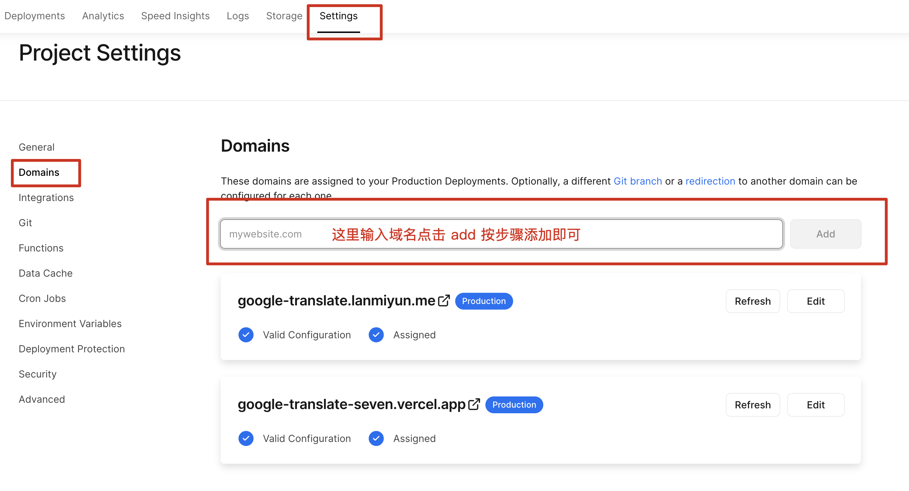
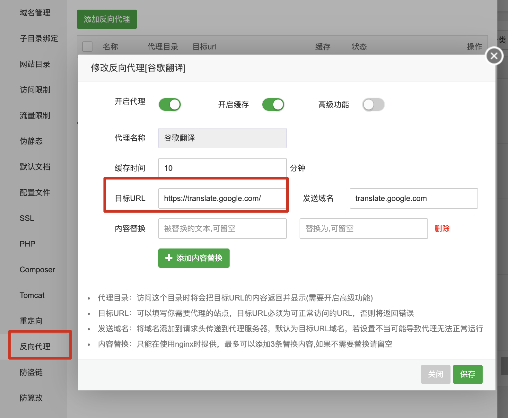
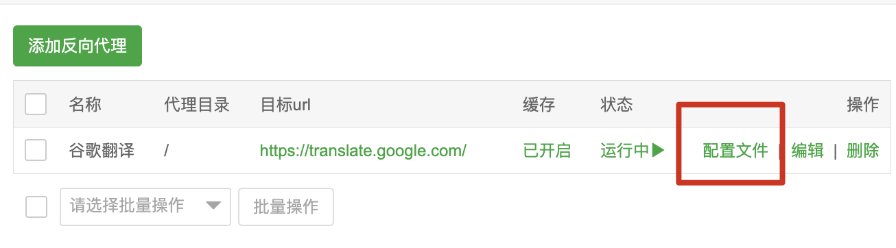

# 谷歌翻译三方代理搭建

> 注意: 前提是必须拥有自己的域名, 没有的话下面的步骤是无法进行下去的!!!

## 使用 Vercel 搭建免费代理

> 部署方式其实很简单,大致步骤如下,如果在某个步骤无法继续随便百度搜索下就能解决,很简单!

1. 需要在本机上安装 `Vercel` 

   ```bash
   npm i -g vercel
   ```

2. 安装号以后,使用 `vsercel login` 命令进行登录,登录过程中根据提示操作即可.

3. 登录成功以后,新建一个 `json` 文件,里面内容如下:

   ```json
   {
       "version": 2,
       "routes": [
           {"src": "/(.*)","dest": "https://translate.google.com/$1"}
       ]
   }
   ```

4. 然后再这个`json`文件所在的目录打开终端(路径中最好不要有中文),执行以下命令,比如我命名的`json`文件名字是`google_translate.json`,那么对应的执行命令如下:

   ```bash
   verceL -A ./google_translate.json --prod
   ```

5. 执行后就开始部署了,根据提示进行相关选择配置接口.部署成功后，控制台会给你一个默认的域名，这个域名打开就能看到你代理的网站了。同时在`vercel`控制台也能看到这个服务。

6. **绑定自己的域名**,如果使用默认分配的域名其实也是被墙的,所以必须绑定自己的域名.

   

7. 在域名解析控制台添加对应的CNAME，记录值就是`cname.vercel-dns.com`，添加完成后解析成功就能正常访问了，ssl证书也省了。

最后验证一下吧! 打开绑定的域名 `xxxx.com` 可以看到谷歌翻译界面就表示成功了.


## 使用Nginx进行配置反向代理

### 必要条件

- 国外vps,可以直接访问google.com的

- 注册一个自己的域名,并开了SSL访问,自己腾讯云申请一个免费一年的证书即可

下面以宝塔的Nginx为例:

新建一个站点,选择 `反向代理`:



目标URL填写:`https://translate.google.com`, 直接点击保存即可!

如果无法使用可以复制下面我的配置项内容:

```

#PROXY-START/

location ^~ /
{
    proxy_pass https://translate.google.com/;
    proxy_set_header Host translate.google.com;
    proxy_set_header X-Real-IP $remote_addr;
    proxy_set_header X-Forwarded-For $proxy_add_x_forwarded_for;
    proxy_set_header REMOTE-HOST $remote_addr;
    proxy_set_header Upgrade $http_upgrade;
    proxy_set_header Connection $connection_upgrade;
    proxy_http_version 1.1;
    # proxy_hide_header Upgrade;
    proxy_ssl_server_name on;
    proxy_ssl_protocols TLSv1 TLSv1.1 TLSv1.2;

    add_header X-Cache $upstream_cache_status;

    #Set Nginx Cache
    
    
    if ( $uri ~* "\.(gif|png|jpg|css|js|woff|woff2)$" )
    {
    	expires 1m;
    }
    proxy_ignore_headers Set-Cookie Cache-Control expires;
    proxy_cache cache_one;
    proxy_cache_key $host$uri$is_args$args;
    proxy_cache_valid 200 304 301 302 10m;
}

#PROXY-END/
```



点击`配置文件`后直接使用我上面的配置即可!

最后访问你的域名验证下是否可以直接访问`谷歌翻译`页面吧!